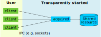

# acquisition-daemon
Framework for a daemon which acquires a shared resource and manages access to
that resource between many processes.

The idea behind this is the clients invoke the daemon front-end (`acquired` in
this example) which transparently starts the daemon if it was not already
running and prints information to connect to it (a local port). Clients then
connect to it and use some IPC (TCP sockets) to communicate and/or access the
resource. After some period of inactivity (10 seconds) the daemon closes itself.
The important part is that the daemon itself is a singleton (to manage accesses
to the shared resource) and the front-end is threadsafe to guarantee this.

This is best shown with a diagram:



This has been written using POSIX system calls, but all of these have a Windows
equivalent and it would be relatively straight forward to port.

Connections are processed on separate handler threads. Release v1.0 contains a
non-pthreaded example which processed connections sequentially.

The current implementation uses a simple text protocol over TCP sockets for IPC
between client and daemon, but this could just as easily be implemented with
named pipes or Google's [Protocol Buffers](https://github.com/protocolbuffers/protobuf).


## Running the example

All source files except `client.c` make up the acquisition daemon (`acquired`).
A minimally functional client implementaion is provided (`client`) purely for
reference to illustrate how the acquisition daemon is expected to be used. The
daemon logs to `.acquired.log`.

The code can be invoked as follows:
```
$ make
$ ./client 
Successfully read from daemon: hello world
```

There is also a `test_client` make target which invokes 32 parallel clients to
illustrate the solution's thread safety.


## License

All files are licensed under
[the MIT license](https://github.com/jonsim/acquisition-daemon/blob/master/LICENSE).

&copy; Copyright 2018 Jonathan Simmonds
